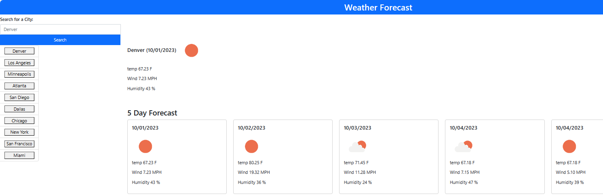

# ServerSideAPIs
[link to live deploy Server Side APIs](https://gonzalogodinez.github.io/refactoring_marketing_agency/serversideapis/)

## Description
As a Developer, I created the Weather 5 day Forecast project to show case HTML, CSS, Java Scripts and server side APIS as HTML CSS Full Stack Front End Web Developer.

This project emphasis the tools mentioned above to architecture a Weather Webpage on any web page using aligned boxes in columns, rows and UI bar tabs to navigate throughout the headers, main content, sections, elements, images, and sections of the weather app. 

## Installation
1. GUI bash terminal point using CD into project directory.
2. Git clone this repo.
3. CD into ServerSideApis.
4. Open using text editor, for VS Code, command 'code .'

## Usage

[Link to live deploy Server Side APIs deploy](https://gonzalogodinez.github.io/refactoring_marketing_agency/serversideapis/)

## License
MIT License

Copyright (c) 2023 GonzaloGodinez

Permission is hereby granted, free of charge, to any person obtaining a copy
of this software and associated documentation files (the "Software"), to deal
in the Software without restriction, including without limitation the rights
to use, copy, modify, merge, publish, distribute, sublicense, and/or sell
copies of the Software, and to permit persons to whom the Software is
furnished to do so, subject to the following conditions:

The above copyright notice and this permission notice shall be included in all
copies or substantial portions of the Software.

THE SOFTWARE IS PROVIDED "AS IS", WITHOUT WARRANTY OF ANY KIND, EXPRESS OR
IMPLIED, INCLUDING BUT NOT LIMITED TO THE WARRANTIES OF MERCHANTABILITY,
FITNESS FOR A PARTICULAR PURPOSE AND NONINFRINGEMENT. IN NO EVENT SHALL THE
AUTHORS OR COPYRIGHT HOLDERS BE LIABLE FOR ANY CLAIM, DAMAGES OR OTHER
LIABILITY, WHETHER IN AN ACTION OF CONTRACT, TORT OR OTHERWISE, ARISING FROM,
OUT OF OR IN CONNECTION WITH THE SOFTWARE OR THE USE OR OTHER DEALINGS IN THE
SOFTWARE.
---
